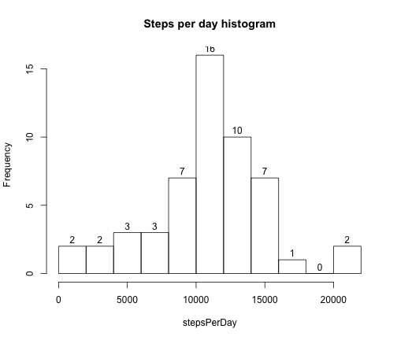
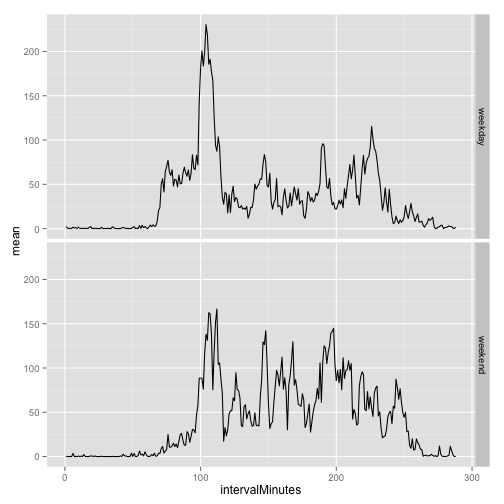

Title
========================================================

Packages and sources required
--------------------------------------------------------
* accompanying "lib.R"
* xtable
* ggplot2
* lattice

Analysis
--------------------------------------------------------

### Data


```r
source("lib.R")
## download and unzip
url <- "https://d396qusza40orc.cloudfront.net/repdata%2Fdata%2Factivity.zip"
dataDir <- "./exdata"
destFilename <- checkDownloadUnzipFile( url, dataDir, "repdata-data-activity.zip" )
timestampFilename <- paste0( destFilename, ".downloadTimestamp" )
## load raw data
downloadTime <- readChar( timestampFilename, file.info(timestampFilename)$size )
dataFilename <- paste0( dataDir, "/activity.csv" )
activity <- read.csv( dataFilename )
```

This report is based on the raw data downloaded from https://d396qusza40orc.cloudfront.net/repdata%2Fdata%2Factivity.zip at time 2014-08-17.16:47
.

### Data summary

Ignoring missing values,

```r
activity$date <- as.factor( activity$date )
validSteps <- activity[ !is.na(activity$steps), ]
```
find the total steps per day.

```r
stepsPerDay <- tapply( validSteps$steps, validSteps$date, sum )
```

The following is the bar plot of the total steps per day and the histogram of the data:

```r
barplot( stepsPerDay, main = "Total steps per day"
       , xlab = "Date", ylab = "Number of steps" )
```

 


```r
hist( stepsPerDay, breaks = 10, labels = TRUE
    , main = "Steps per day histogram" )
```

 

The following is a summary of the steps per day data:

```r
library(xtable)
xt <- xtable( data.frame( Mean = mean( stepsPerDay, na.rm = TRUE )
                          , Median = median( stepsPerDay, na.rm = TRUE ) ) )
print( xt, include.rownames = FALSE, type="html" )
```

<!-- html table generated in R 3.1.0 by xtable 1.7-3 package -->
<!-- Sun Aug 17 16:47:43 2014 -->
<TABLE border=1>
<TR> <TH> Mean </TH> <TH> Median </TH>  </TR>
  <TR> <TD align="right"> 10766.19 </TD> <TD align="right"> 10765 </TD> </TR>
   </TABLE>

### Average daily summary


```r
## convert interval to absolute minute of the day instead of military time
hours <- floor( activity$interval/100 )
activity$intervalMinutes <- hours*60 + ( activity$interval - hours*100 )
activity$intervalMinutes <- as.factor( activity$intervalMinutes )
## average per minute interval over all the days
dailySummary <- tapply( activity$steps, activity$intervalMinutes, mean
                      , na.rm = TRUE )
plot( names(dailySummary), dailySummary, type = "l"
    , main = "Average daily summary", xlab = "5-minute-interval of day"
    , ylab = "Number of steps")
```

 


```r
summaryMaxSteps <- dailySummary[ dailySummary == max(dailySummary) ]
summaryMaxMinute <- as.numeric( names(summaryMaxSteps) )
summaryMaxHour <- floor( summaryMaxMinute/60 )
summaryMaxMinuteOfHour <- summaryMaxMinute - summaryMaxHour*60
c(summaryMaxSteps, summaryMaxMinute, summaryMaxHour, summaryMaxMinuteOfHour)
```

```
##   515                   
## 206.2 515.0   8.0  35.0
```

The 5-minute interval starting at the 515 minute of the day
(interval at hour 8minute 35 of the day) 
contains the **maximum** number 
of steps (206.1698) in the summary.

### Imputing missing values


```r
numMissing <- sum( is.na(activity$steps) )
numMissing
```

```
## [1] 2304
```


There are 2304 missing values in the dataset.

Choose to simply fill in the missing values using the mean for that 5-minute interval
of the day as found in the section "Average daily summary".


```r
imputedSteps <- apply( activity, 1, function(x) {
  stepsResolved <- x["steps"]
  if( is.na(stepsResolved) ) {
    stepsResolved <- dailySummary[ as.character(x["intervalMinutes"]) ]
  }
  stepsResolved
  } 
  )
imputedActivity <- data.frame( steps = as.numeric( imputedSteps )
                             , date = activity$date
                             , interval = activity$interval )
```


Using the new data created by imputing the missing values, the new histogram
and data summary for total steps per day is:


```r
imputedStepsPerDay <- tapply( imputedActivity$steps, imputedActivity$date, sum )
hist( imputedStepsPerDay, breaks = 10, labels = TRUE
    , main = "Histogram (w imputed data)", xlab = "Steps per day" )
```

 


```r
xt <- xtable( data.frame( Mean = mean( imputedStepsPerDay )
                          , Median = median( imputedStepsPerDay ) ) )
print( xt, include.rownames = FALSE, type="html" )
```

<!-- html table generated in R 3.1.0 by xtable 1.7-3 package -->
<!-- Sun Aug 17 16:47:44 2014 -->
<TABLE border=1>
<TR> <TH> Mean </TH> <TH> Median </TH>  </TR>
  <TR> <TD align="right"> 10766.19 </TD> <TD align="right"> 10766.19 </TD> </TR>
   </TABLE>

The mean was not affected by the inclusing of the imputed data. However, the median
**was** altered by the change. 
As for overall daily step total frequency, the addition of the 
imputed values increased the number of days that are reported to have total step
counts in the "middle" of the range of totals. That is, the added imputed values
directly were calculated into in day totals that were exactly or near the sum of
all the steps in the intervals in the "Average daily summary" section. This is
as expected since the "Average daily summary" data was used to create the
imputed values in the first place.

### Weekdays vs weekends (with imputed data)

Using the part of the week (weekday vs weekend), again calculate each
interval daily summary for each week part.

```r
weekpart <- apply( imputedActivity, 1, function(x) {
  weekday <- weekdays( as.POSIXct( x["date"] ) )
  part <- "weekday"
  if( weekday == "Saturday" | weekday == "Sunday" ) {
    part <- "weekend"
  }
  part
  }
  )
imputedActivity$weekpart <- weekpart
## again use absolute minute of the day instead of military time
imputedActivity$intervalMinutes <- activity$intervalMinutes
## average per minute interval over all the days per week part
library(plyr)
dailySummary <- ddply( imputedActivity, .(intervalMinutes, weekpart)
                       , summarize, mean = mean(steps) )
dailySummary$intervalMinutes <- as.numeric( dailySummary$intervalMinutes )

library(ggplot2)
ggplot( dailySummary, aes( intervalMinutes, mean ) ) +
  geom_path( aes(group=weekpart) ) + facet_grid( weekpart ~. )
```

 

```r
##library(lattice)
##xyplot( mean ~ intervalMinutes | weekpart, data = dailySummary, type = "l"
##        , layout = c(1,2) )
```
